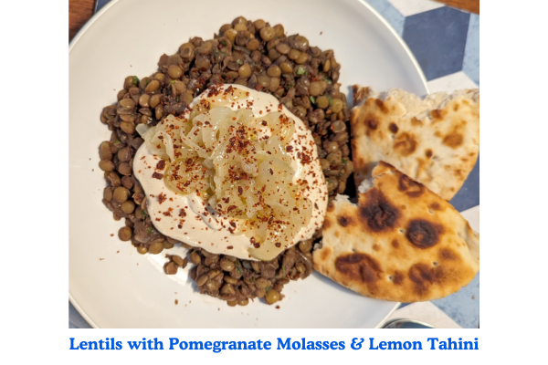

<!-- recipe-01 -->
<!-- Title should be a maximum of 38 characters including spaces. Update the title, type, prev, and next as needed. Use UK English throughout. 
     Never remove comments in this markdown file. Edits can only build on the points so they don't update and remove detail.
     recipe-03. The first line stating recipe-03 needs to be the same recipe-##, in the line with the image. -->

Serves **2**, Total Time **40 min** (Prep **15 min**, Cook **25 min**)
<!-- Provide the serving size and total time, breaking down into prep, marinate, and cook times. -->

<!-- Provide the URL to the image. Replace 'recipe-03.png' with the actual image file path. -->

> A vibrant and satisfying plate, cauliflower steaks with chimichurri and butter bean purée bring together bold flavours and creamy textures.
> <!-- Jay Rayner-style summary should be: Dynamic and engaging, with a focus on storytelling and drawing readers into the dining experience. -->

## Ingredients
<!-- List all ingredients in the order they will be used, with exact measurements and any preparation details. Use the format: **[Amount] [Ingredient]**, [Preparation details in italics]. If dicing or chopping, provide an indication of thickness/size in mm. -->

### For the cauliflower
- **2 cauliflower steaks** (from 1 large cauli)
- **1 tbsp smoked paprika**
- **3 garlic cloves**
- **2 tbsp butter**
- **Salt**
- **Pepper**
- **Olive oil**

### For the chimichurri
- **Large bunch of parsley**, *finely chopped*
- **1 garlic clove**, *minced*
- **1 red chilli**, *finely diced, 2-3 mm*
- **2 tbsp red wine vinegar**
- **100ml extra virgin olive oil**
- **Salt**
- **Pepper**

### For the butter bean purée
- **700g jarred butter beans**
- **1 lemon**, *juiced*
- **1 garlic clove**
- **2 tbsp nutritional yeast**
- **Salt**
- **Pepper**

## Instructions
<!-- Break down the instructions into clear steps. Use a conversational yet informative tone. Add equipment if appropriate. Use UK English throughout. 
     Add doneness instructions after the relevant step, and format the text in italics. 
     List any special equipment needed for the recipe, in this format: Equipment: **[Item]** -->

Equipment: **Frying pan**
<!-- List any special equipment needed for the recipe, in this format: Equipment: **[Item]** -->

{}

<!-- Include this step if using an oven, and bold the temperature, e.g., **200°C / Gas Mark 6** -->
<!-- ### **Preheat the oven:**
Set your oven to the required temperature. -->

### **Make the chimichurri:**
Finely chop the fresh herbs, then add to a mixing bowl. Finely dice the chilli, mince the garlic and add to the herbs with the vinegar. Season to taste, then stream in the olive oil whilst mixing until thoroughly combined. Set aside.

### **Prepare the butter bean purée:**
Pour the butter beans into a blender with the juice of a lemon, salt, pepper, 1 garlic clove, and nutritional yeast. Blend until smooth.

### **Prepare the cauliflower steaks:**
Chop the cauliflower into steaks - you should be able to get two from the middle of a large one. Save the extra florets for another recipe, or roast with salt, pepper, paprika, and olive oil to serve alongside the steaks. Chop up the leaves and stems and set aside for a zero-waste garnish.

### **Season the cauliflower:**
Season the steaks with salt, pepper, and paprika on both sides, then drizzle with oil and massage well.

### **Cook the cauliflower steaks:**
Heat a frying pan to medium high. Add 2 tbsp olive oil. Once hot, add the steak - press down to sear. After several minutes, flip and fry the other side until golden brown. Bash the garlic cloves, add with the butter and baste continuously. *The steaks should be golden brown and crisp on the outside, and tender on the inside.*

### **Serve:**
Pour the butter bean purée into the middle of a plate. Place the steak on top, drizzle with chimichurri and scatter over the cauliflower leaves.

{}

## Information
<!-- Use tabs to organise additional information. -->



  
  ### Overview
  - **Credit:** [alfiecooks_'s Instagram Post](https://www.instagram.com/reel/C38JjduK6vf/) by Alfie
  <!-- Use this format for credits: **Credit:** [Link](URL) by Author. -->
  - **Timings:** Total Time **40 min** (Prep **15 min**, Cook **25 min**)
  <!-- Provide the total time followed by prep and cook times in parentheses. -->
  - **On the day, before:** Ensure all ingredients are prepped and ready before starting the cooking process.
  <!-- Include the following section if any prep is needed the day before or earlier the same day -->
  - **Serving Suggestion:** Pair with a simple green salad.
  - **Storage Instructions:** Store any leftovers in an airtight container in the refrigerator for up to 2 days.
  

  
  ### Nutrition Information (Optional)
  <!-- Provide nutritional information per serving if available. -->
  - **Calories:** [Calories]
  - **Protein:** [Protein]
  - **Fat:** [Fat]
  - **Carbohydrates:** [Carbohydrates]
  - **Fibre:** [Fibre]
  - **Sugar:** [Sugar]
  

  
  ### Tips
  - **Important Tip:** Make sure to press down the cauliflower steaks while searing to get a good crust.
  - **For Extra Crispy Cauliflower:** Pat the steaks dry before seasoning.
  - **Cooking Time:** Ensure the cauliflower is tender by checking with a fork.
  - **Butter Bean Purée:** Adjust the consistency by adding more olive oil or water as needed.
  <!-- Add any additional tips specific to the recipe here. Provide helpful tips to ensure the dish turns out perfectly. -->
  

  
  ### List
  <!-- Provide a shopping list of all ingredients, in alphabetical order by the main ingredient. Use the format: **[Ingredient]** ([Amount]) 
       Merge items if they appear more than once. Count the total amount accurately. -->

  - **Butter** (2 tbsp)
  - **Cauliflower steaks** (2, from 1 large cauli)
  - **Garlic cloves** (4)
  - **Lemon** (1, juiced)
  - **Nutritional yeast** (2 tbsp)
  - **Parsley** (large bunch, finely chopped)
  - **Red chilli** (1, finely diced, 2-3 mm)
  - **Red wine vinegar** (2 tbsp)
  - **Smoked paprika** (1 tbsp)
  - **Butter beans** (700g, jarred)
  - **Extra virgin olive oil** (100ml)
  - **Olive oil**
  - **Salt**
  - **Pepper**
  


