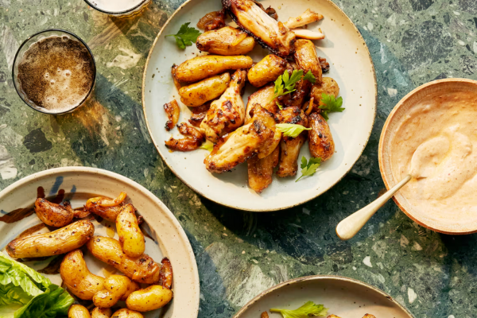

<!-- recipe-02 -->
<!-- Title should be a maximum of 38 characters including spaces. Update the title, type, prev, and next as needed. Use UK English throughout. 
     Never remove comments in this markdown file. Edits can only build on the points so they don't update and remove detail.
     recipe-03. The first line stating recipe-03 needs to be the same recipe-##, in the line with the image. -->

Serves **2**, Total Time **1 hr 40 min** (Prep **15 min**, Marinate **1 hr +**, Cook **25 min**)
<!-- Provide the serving size and total time, breaking down into prep, marinate, and cook times. -->

<!-- Provide the URL to the image. Replace 'recipe-03.png' with the actual image file path. -->

> Crispy chicken wings and tender baby potatoes, enhanced by the subtle heat of harissa yoghurt.
> <!-- Grace Dent-style summary should be: Comforting, charming, and nostalgic, emphasising the emotional connection to food and its ability to bring people together. -->

## Ingredients
<!-- List all ingredients in the order they will be used, with exact measurements and any preparation details. Use the format: **[Amount] [Ingredient]**, [Preparation details in italics]. If dicing or chopping, provide an indication of thickness/size in mm. -->

### For the chicken wings
- **6 chicken wings**, cut in half to drumstick and winglet
- **1 lemon**, *half thinly sliced for marinade, juice of remaining half for serving*

### For the marinade
- **3 garlic cloves**, *peeled and smashed*
- **1 tsp sea salt**
- **A generous pinch freshly ground black pepper**
- **1 tbsp wholegrain mustard**
- **1 tbsp dijon mustard**
- **1 heaped tsp honey**
- **1 tbsp olive oil**

### For the baby potatoes
- **1 bag small baby potatoes** (the ratte variety work beautifully here, but any small ones will do)
- **2 tbsp olive oil** (for frying)

### For the harissa yoghurt
- **3 tbsp yoghurt**
- **1 tsp harissa**

### To serve
- **A few parsley or celery leaves**, *picked*

## Instructions
<!-- Break down the instructions into clear steps. Use a conversational yet informative tone. Add equipment if appropriate. Use UK English throughout. 
     Add doneness instructions after the relevant step, and format the text in italics. 
     List any special equipment needed for the recipe, in this format: Equipment: **[Item]** -->

Equipment: **Air fryer**, **Mixing bowls**

{}

<!-- Include this step if using an oven, and bold the temperature, e.g., **200°C / Gas Mark 6** -->
<!-- ### **Preheat the oven:**
Set your oven to the required temperature. -->

### **Prepare the wings:**
Put the cut wing halves in a bowl. Cut the lemon in half, and set one half aside. Cut the remaining half-lemon into quarters, then thinly slice it and add to the wings bowl. Add all the marinade ingredients to the bowl, mix to coat and set aside for at least an hour or so and up to 48 hours.

### **Cook the wings:**
Heat the air fryer to **200°C** for three minutes. Tip all the wings and the marinade into the crisper tray and set the timer for 12 minutes. Once the time is up, lift the tray out of the air fryer, give it a good shake so the wings turn and to ensure they color all over, then return to the fryer for another five minutes. *The wings should be golden brown and crispy.*

### **Cook the potatoes:**
Transfer the wings to a bowl and cover, then put the potatoes into the air fryer – there is no need to add anything else because the tray will have all the juices from cooking the wings. Cook for 10 minutes, still at **200°C**, then return the wings to the tray, laying them on top of the potatoes. Cook for a final four minutes, so everything is nice and hot. *The potatoes should be tender and the wings hot.*

### **Prepare the yoghurt:**
Meanwhile, mix the yoghurt with the harissa.

### **Serve:**
Plate up the wings and potatoes, squeeze the juice of the reserved half-lemon over the wings, then scatter the parsley or celery over the lot and serve.

{}

## Information
<!-- Use tabs to organise additional information. -->



  
  ### Overview
  - **Credit:** [The Guardian's Honey & Co’s Air-Fryer Chicken Wings with Baby Potatoes](https://www.theguardian.com/food/article/2024/jun/06/honey-co-airfryer-adventures-chicken-wings-with-baby-potatoes-and-harissa-yoghurt-recipe) by Sarit Packer and Itamar Srulovich
  <!-- Use this format for credits: **Credit:** [Link](URL) by Author. -->
  - **Timings:** Total Time **1 hr 40 min** (Prep **15 min**, Marinate **1 hr +**, Cook **25 min**)
  <!-- Provide the total time followed by prep and cook times in parentheses. -->
  - **On the day, before:** Ensure all ingredients are prepped and ready before starting the cooking process.
  <!-- Include the following section if any prep is needed the day before or earlier the same day -->
  - **Serving Suggestion:** Serve with a simple green salad and garlic bread.
  - **Storage Instructions:** Store any leftovers in an airtight container in the refrigerator for up to 2 days. Reheat gently in a skillet with a splash of water to loosen the sauce.
  

  
  ### Nutrition Information (Optional)
  <!-- Provide nutritional information per serving if available. -->
  - **Calories:** [Calories]
  - **Protein:** [Protein]
  - **Fat:** [Fat]
  - **Carbohydrates:** [Carbohydrates]
  - **Fibre:** [Fibre]
  - **Sugar:** [Sugar]
  

  
  ### Tips
  - **Important Tip:** Shake the air fryer basket halfway through cooking to ensure even browning.
  - **For Extra Crispy Wings:** Pat the wings dry with paper towels before marinating.
  - **Marinating Time:** For best flavour, marinate the wings for at least 1 hour or up to 48 hours.
  - **Yoghurt Sauce:** Adjust the amount of harissa in the yoghurt to your preferred spice level.
  <!-- Add any additional tips specific to the recipe here. Provide helpful tips to ensure the dish turns out perfectly. -->
  

  
  ### List
  <!-- Provide a shopping list of all ingredients, in alphabetical order by the main ingredient. Use the format: **[Ingredient]** ([Amount]) 
       Merge items if they appear more than once. Count the total amount accurately. -->

  - **Baby potatoes** (1 bag)
  - **Chicken wings** (6, cut in half to drumstick and winglet)
  - **Fresh parsley or celery leaves** (for garnish, picked)
  - **Garlic cloves** (3, peeled and smashed)
  - **Harissa** (1 tsp)
  - **Honey** (1 heaped tsp)
  - **Lemon** (1, half thinly sliced for marinade, juice of remaining half for serving)
  - **Olive oil** (3 tbsp, plus extra for cooking)
  - **Sea salt** (1 tsp)
  - **Wholegrain mustard** (1 tbsp)
  - **Yoghurt** (3 tbsp)
  


