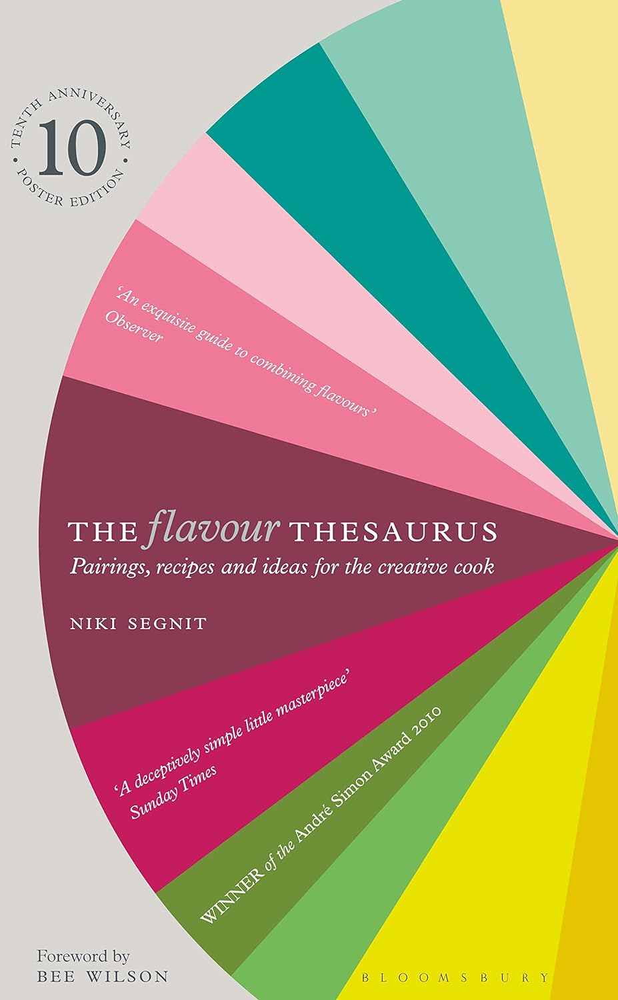

<!-- Title should be a maximum of 38 characters including spaces. Update the title, type, prev, and next as needed. Use UK English throughout. 
     Never remove comments in this markdown file. Edits can only build on the points so they don't update and remove detail. -->

Serves **4**, Total Time **1 hr** (Prep **15 min**, Cook **45 min**)
<!-- Provide the serving size and total time, breaking down into prep, marinate, and cook times. -->

<!-- Provide the URL to the image. Replace 'images/lentils_pomegranate_molasses.jpg' with the actual image file path. -->

> A comforting bowl of lentils, brightened by pomegranate molasses and lemon tahini, offering a beautiful balance of flavours.

## Ingredients
<!-- List all ingredients in the order they will be used, with exact measurements and any preparation details. Use the format: **[Amount] [Ingredient]**, [Preparation details in italics]. If dicing or chopping, provide an indication of thickness/size in mm. -->

### For the lentils
- **200g green or puy lentils**
- **1 onion**, *finely chopped*
- **2 garlic cloves**, *minced*
- **1 carrot**, *diced, 5 mm*
- **2 tbsp olive oil**
- **1 tsp ground cumin**
- **1 tsp ground coriander**
- **1 tsp ground turmeric**
- **1 litre vegetable stock**
- **Salt**
- **Pepper**

### For the pomegranate molasses dressing
- **2 tbsp pomegranate molasses**
- **1 tbsp olive oil**
- **1 garlic clove**, *minced*
- **1 tsp ground cumin**
- **Salt**
- **Pepper**

### For the lemon tahini sauce
- **3 tbsp tahini**
- **1 lemon**, *juiced*
- **1 garlic clove**, *minced*
- **3-4 tbsp water** (to thin)
- **Salt**

### To serve
- **Pomegranate seeds**
- **Fresh parsley**, *chopped*

## Instructions
<!-- Break down the instructions into clear steps. Use a conversational yet informative tone. Add equipment if appropriate. Use UK English throughout. 
     Add doneness instructions after the relevant step, and format the text in italics. -->

Equipment: **Large pot**, **Mixing bowls**
<!-- List any special equipment needed for the recipe, in this format: Equipment: **[Item]** -->

{}

<!-- Include this step if using an oven, and bold the temperature, e.g., **200°C / Gas Mark 6** -->
<!-- ### **Preheat the oven:**
Set your oven to the required temperature. -->

### **Cook the lentils:**
Rinse the lentils under cold water. In a large pot, heat the olive oil over medium heat. Add the chopped onion, minced garlic, and diced carrot. Sauté for about 5 minutes, until softened. Stir in the ground cumin, coriander, and turmeric, and cook for another minute. Add the lentils and vegetable stock, bring to a boil, then reduce the heat and simmer for about 30-35 minutes, until the lentils are tender. *The lentils should be tender but not mushy.*

### **Make the pomegranate molasses dressing:**
In a small bowl, whisk together the pomegranate molasses, olive oil, minced garlic, ground cumin, salt, and pepper. Set aside.

### **Prepare the lemon tahini sauce:**
In another bowl, whisk together the tahini, lemon juice, minced garlic, and salt. Gradually add water until you reach a smooth, pourable consistency.

### **Serve:**
Spoon the cooked lentils onto plates. Drizzle with the pomegranate molasses dressing and the lemon tahini sauce. Garnish with pomegranate seeds and chopped fresh parsley.

{}

## Information
<!-- Use tabs to organise additional information. -->



  
  ### Overview
  - **Credit:** [The Guardian's Lentils with Pomegranate Molasses & Lemon Tahini](https://www.theguardian.com/food/article/2024/may/11/lentils-pomegranate-molasses-lemon-tahini-recipe-vegan-meera-sodha) by Meera Sodha
  <!-- Use this format for credits: **Credit:** [Link](URL) by Author. -->
  - **Timings:** Total Time **1 hr** (Prep **15 min**, Cook **45 min**)
  <!-- Provide the total time followed by prep and cook times in parentheses. -->
  - **On the day, before:** Ensure all ingredients are prepped and ready before starting the cooking process.
  <!-- Include the following section if any prep is needed the day before or earlier the same day -->
  - **Serving Suggestion:** Serve with crusty bread or a side salad.
  - **Storage Instructions:** Store any leftovers in an airtight container in the refrigerator for up to 3 days.
  

  
  ### Nutrition Information (Optional)
  <!-- Provide nutritional information per serving if available. -->
  - **Calories:** [Calories]
  - **Protein:** [Protein]
  - **Fat:** [Fat]
  - **Carbohydrates:** [Carbohydrates]
  - **Fibre:** [Fibre]
  - **Sugar:** [Sugar]
  

  
  ### Tips
  - **Important Tip:** Make sure to rinse the lentils thoroughly to remove any debris.
  - **For Extra Flavour:** Toast the spices in the pot before adding the lentils and stock.
  - **Cooking Time:** Keep an eye on the lentils to ensure they don't become too mushy.
  - **Lemon Tahini Sauce:** Adjust the water amount to get your desired consistency.
  <!-- Add any additional tips specific to the recipe here. Provide helpful tips to ensure the dish turns out perfectly. -->
  

  
  ### List
  <!-- Provide a shopping list of all ingredients, in alphabetical order by the main ingredient. Use the format: **[Ingredient]** ([Amount]) 
       Merge items if they appear more than once. Count the total amount accurately. -->

  - **Carrot** (1, diced, 5 mm)
  - **Fresh parsley** (for garnish, chopped)
  - **Garlic cloves** (4, minced)
  - **Green or puy lentils** (200g)
  - **Ground cumin** (2 tsp)
  - **Ground coriander** (1 tsp)
  - **Ground turmeric** (1 tsp)
  - **Lemon** (1, juiced)
  - **Olive oil** (3 tbsp, plus extra for cooking)
  - **Onion** (1, finely chopped)
  - **Pomegranate molasses** (2 tbsp)
  - **Pomegranate seeds** (for garnish)
  - **Salt**
  - **Pepper**
  - **Tahini** (3 tbsp)
  - **Vegetable stock** (1 litre)
  


