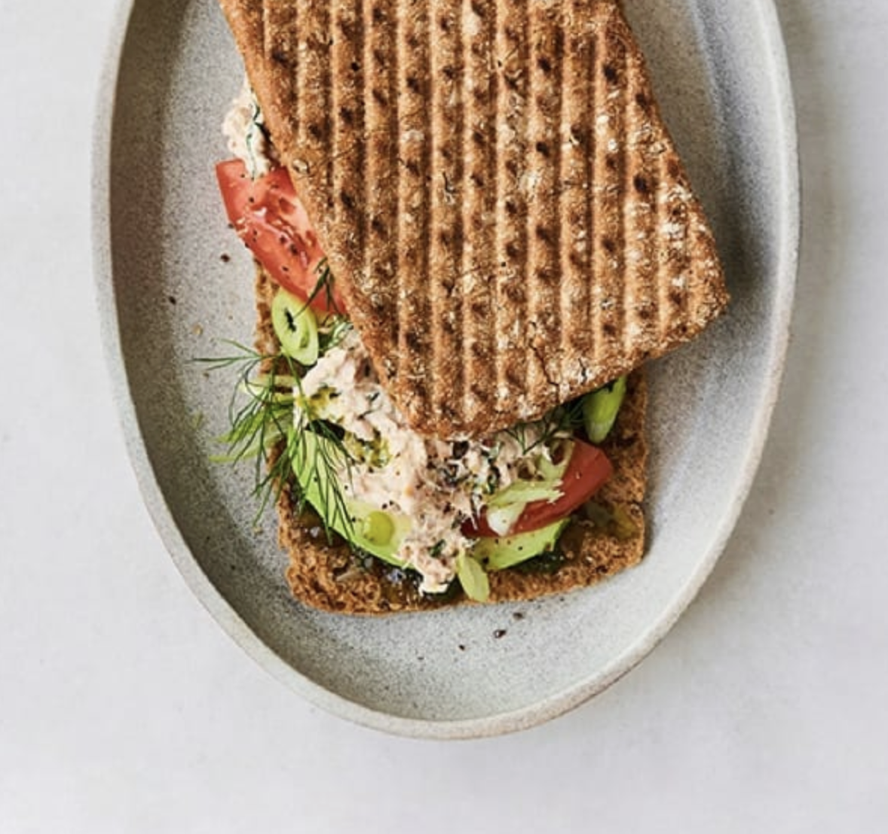

<!-- recipe-04 -->
<!-- Title should be a maximum of 38 characters including spaces. Update the title, type, prev, and next as needed. Use UK English throughout. 
     Never remove comments in this markdown file. Edits can only build on the points so they don't update and remove detail.
     recipe-04. The first line stating recipe-04 needs to be the same recipe-##, in the line with the image. -->

Serves **2**, Total Time **36 min** (Prep **30 min**, Cook **6 min**)
<!-- Provide the serving size and total time, breaking down into prep, marinate, and cook times. -->

<!-- Provide the URL to the image. Replace 'recipe-04.png' with the actual image file path. -->

> <!-- Nigella Lawson-style summary should be: Warm, inviting, and intimate, creating a sense of comfort and indulgence. -->
> The perfect blend of crispy and creamy, this tunacado sandwich is elevated with a spicy pesto aioli and fresh avocado.

## Ingredients
<!-- List all ingredients in the order they will be used, with exact measurements and any preparation details. Use the format: **[Amount] [Ingredient]**, [Preparation details in italics]. If dicing or chopping, provide an indication of thickness/size in mm. -->

### For the spicy pesto aioli
- **1/4 cup pesto**
- **1/4 cup mayonnaise**
- **1 tbsp chili crunch**
- **1 tsp honey**
- **1/2 tbsp lemon juice**
- **Fine salt and ground black pepper**, *to taste*

### For the sandwich
- **5 oz canned tuna**, *drained*
- **3 tbsp mayonnaise**
- **1 1/2 tsp dijon mustard**
- **1 tbsp lemon zest** (from 1 lemon)
- **1 1/2 tsp lemon juice**
- **2 garlic cloves**
- **1 tbsp drained capers**
- **2 tsp anchovy paste**, or 3 anchovy filets
- **1 tbsp dried dill**, or 2 sprigs fresh dill
- **1/4 cup diced red onion**
- **1/4 tsp fine salt**, more to taste
- **1/4 tsp ground black pepper**
- **4 thin slices whole wheat flatbread**, sourdough, or focaccia
- **4 slices tomato**
- **1 large ripe avocado**, *sliced*
- **Pickled sliced banana peppers**, *for serving*

## Instructions
<!-- Break down the instructions into clear steps. Use a conversational yet informative tone. Add equipment if appropriate. Use UK English throughout. 
     Add doneness instructions after the relevant step, and format the text in italics. 
     List any special equipment needed for the recipe, in this format: Equipment: **[Item]** -->

Equipment: **Food processor**, **Large skillet**
<!-- List any special equipment needed for the recipe, in this format: Equipment: **[Item]** -->

{}

<!-- Include this step if using an oven, and bold the temperature, e.g., **200°C / Gas Mark 6** -->
<!-- ### **Preheat the oven:**
Set your oven to the required temperature. -->

### **Make the spicy pesto aioli:**
In a small bowl, stir together the pesto, mayonnaise, chili crunch, honey, and lemon juice. Season to taste with salt and pepper. Set aside until it’s time to assemble the sandwiches.

### **Prepare the tuna mixture:**
Place the tuna, mayonnaise, mustard, lemon zest and juice, garlic cloves, capers, anchovy paste, and dill in the bowl of a food processor. Pulse on high until smooth and an almost “whipped” consistency is achieved, stopping as needed to scrape down the sides of the food processor, about 1 minute.

### **Add onions and seasoning:**
Stir in the chopped onions, salt, and pepper. Adjust the seasoning as desired.

### **Toast the bread:**
Heat 1 tablespoon oil in a large skillet over medium-high, then add 2 pieces of bread at a time, cut side-down. Weigh down using a small skillet or pot and cook until the pieces are golden brown and crispy, 2 to 3 minutes. Remove from the skillet (just brown the interior of the bread) and toast the remaining 2 slices.

### **Assemble the sandwiches:**
Divide and spread the spicy pesto aioli over the toasted side of each piece of bread. Divide and spread the tuna mixture across two pieces of the bread. Then layer each tuna-topped piece of bread with 2 slices of tomato and as much avocado as desired. Top with banana peppers for a slightly spicy-briney punch, if desired. Close sandwiches, slice in half, and serve.

{}

## Information
<!-- Use tabs to organise additional information. -->



  
  ### Overview
  - **Credit:** [The Spruce Eats' Copycat Joe & The Juice Tunacado Sandwich](https://www.thespruceeats.com/copycat-joe-and-the-juice-tunacado-sandwich-7107018) by Lauryn Bodden, tested by Joan Velush
  <!-- Use this format for credits: **Credit:** [Link](URL) by Author. -->
  - **Timings:** Total Time **36 min** (Prep **30 min**, Cook **6 min**)
  <!-- Provide the total time followed by prep and cook times in parentheses. -->
  - **On the day, before:** Ensure all ingredients are prepped and ready before starting the cooking process.
  <!-- Include the following section if any prep is needed the day before or earlier the same day -->
  - **Serving Suggestion:** Serve with a side of crispy fries or a fresh salad.
  - **Storage Instructions:** The pesto and tuna mixture can be made up to 3 days in advance. Store any assembled sandwiches in an airtight container in the refrigerator for up to 1 day.
  

  
  ### Nutrition Information (Optional)
  <!-- Provide nutritional information per serving if available. -->
  - **Calories:** 1178
  - **Protein:** 41g
  - **Fat:** 65g
  - **Carbohydrates:** 116g
  

  
  ### Tips
  - **Important Tip:** Make the tuna mixture as smooth and spreadable as you like by tweaking the amount of mayo you add.
  - **Bread Slicing:** If using focaccia, slice it widthwise into thin slices. A good bread knife will help with this.
  - **Crispy Bread:** Take your time toasting the bread to make sure it's nice and browned.
  - **Make Ahead:** The pesto and tuna mixture can be made up to 3 days in advance. For the tuna mixture, wait to add the onions until right before serving as their flavor can overwhelm everything else if allowed to sit.
  <!-- Add any additional tips specific to the recipe here. Provide helpful tips to ensure the dish turns out perfectly. -->
  

  
  ### List
  <!-- Provide a shopping list of all ingredients, in alphabetical order by the main ingredient. Use the format: **[Ingredient]** ([Amount]) 
       Merge items if they appear more than once. Count the total amount accurately. -->

  - **Anchovy paste** (2 tsp, or 3 anchovy filets)
  - **Avocado** (1 large, sliced)
  - **Banana peppers** (pickled, sliced, for serving)
  - **Capers** (1 tbsp, drained)
  - **Chili crunch** (1 tbsp)
  - **Dijon mustard** (1 1/2 tsp)
  - **Dill** (1 tbsp dried, or 2 sprigs fresh)
  - **Garlic cloves** (2)
  - **Lemon** (1, zest and juice)
  - **Lemon juice** (1/2 tbsp)
  - **Mayonnaise** (1/4 cup for aioli, 3 tbsp for tuna mixture)
  - **Olive oil**
  - **Pesto** (1/4 cup)
  - **Pickled sliced banana peppers** (for serving)
  - **Red onion** (1/4 cup, diced)
  - **Salt**
  - **Pepper**
  - **Sourdough, whole wheat flatbread, or focaccia** (4 thin slices)
  - **Tomato** (4 slices)
  


